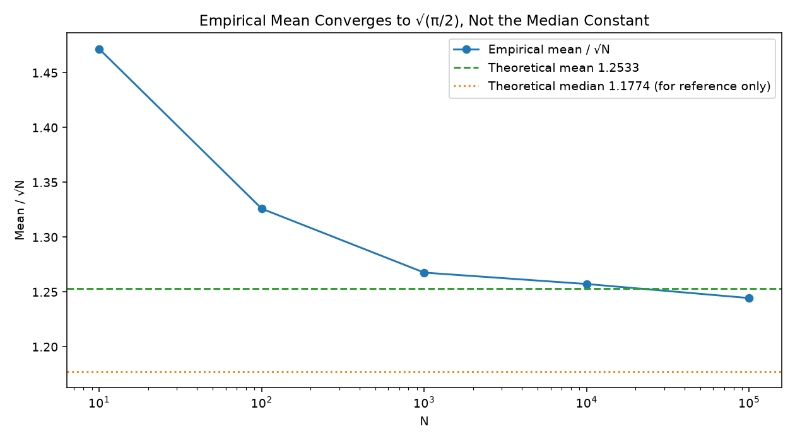
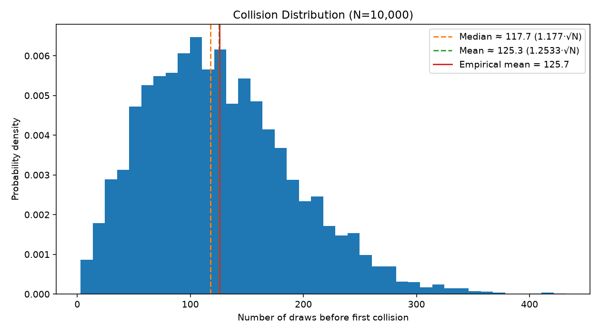

# Twenty-three people, 256 bits

Date: 2026-09-02
Description: A purely combinatorial fact about shared birthdays forces a real engineering decision made decades later, why cryptographic hashes are 256 bits, not 128.
Canonical: https://sslog.dpdns.org/birthday-attack.html

In a room of 23 people, including you, there's a better than 50% chance two of
them share a birthday.

The linear intuition says: 365 days in a year, so you'd need somewhere around
365/2 ≈ 183 people before a shared birthday becomes likely. Twenty-three feels
absurdly small next to that. But the linear intuition is answering a different
question than the one being asked: it's really computing "how many people
until *someone* shares *my* birthday," which is a much harder thing to arrange
than "how many people until *any two* of them share *a* birthday." Those sound
similar. They're not, and the gap between them is the entire subject of this
post.

## Pairs, not people

The fix is to stop counting people and start counting pairs. With n people
there are n(n-1)/2 possible pairs, and each pair is an independent shot at a
1-in-365 match. At n = 23 that's 253 pairs, and 253 independent chances at a
1/365 event is enough to cross 50%, even though 23 people is nowhere near 365.

Made exact: the probability that none of n people share a birthday, out of N
possible days, is

<math display="block">
  <mrow>
    <mi>P</mi><mo>(</mo><mtext>no collision</mtext><mo>)</mo>
    <mo>=</mo>
    <mfrac><mi>N</mi><mi>N</mi></mfrac>
    <mo>&#183;</mo>
    <mfrac><mrow><mi>N</mi><mo>&#8722;</mo><mn>1</mn></mrow><mi>N</mi></mfrac>
    <mo>&#183;</mo>
    <mfrac><mrow><mi>N</mi><mo>&#8722;</mo><mn>2</mn></mrow><mi>N</mi></mfrac>
    <mo>&#183;</mo><mo>&#8943;</mo><mo>&#183;</mo>
    <mfrac><mrow><mi>N</mi><mo>&#8722;</mo><mi>n</mi><mo>+</mo><mn>1</mn></mrow><mi>N</mi></mfrac>
  </mrow>
</math>

For N large relative to n this approximates cleanly to

<math display="block">
  <mrow>
    <mi>P</mi><mo>(</mo><mtext>no collision</mtext><mo>)</mo>
    <mo>&#8776;</mo>
    <msup><mi>e</mi><mrow><mo>&#8722;</mo><mfrac><mrow><mi>n</mi><mo>(</mo><mi>n</mi><mo>&#8722;</mo><mn>1</mn><mo>)</mo></mrow><mrow><mn>2</mn><mi>N</mi></mrow></mfrac></mrow></msup>
    <mo>&#8776;</mo>
    <msup><mi>e</mi><mrow><mo>&#8722;</mo><mfrac><msup><mi>n</mi><mn>2</mn></msup><mrow><mn>2</mn><mi>N</mi></mrow></mfrac></mrow></msup>
  </mrow>
</math>

Set P(collision) = 1 − e^(−n²/2N) equal to 0.5 and solve for n:

<math display="block">
  <mrow>
    <mi>n</mi><mo>&#8776;</mo><mn>1.177</mn><mo>&#183;</mo><msqrt><mi>N</mi></msqrt>
  </mrow>
</math>

Plug in N = 365 and you get n ≈ 22.5; round up, and there's the 23.

Stripped of the birthday framing entirely, the structural fact underneath is:
if you're throwing n items into N bins at random, a collision (two items
landing in the same bin) becomes likely after roughly **√N** items, not N,
not N/2.

**1.177·√N is a median, though, not a mean**: it's the point where collision
probability crosses 50%, not the number of draws you should *expect* on
average. Those are different quantities whenever the underlying distribution
is skewed, and this one is: most collisions land early, but a long right tail
of late arrivals drags the average upward. Solving for the actual expected
value gives a second, larger constant:

<math display="block">
  <mrow>
    <mi>E</mi><mo>[</mo><mtext>draws until collision</mtext><mo>]</mo>
    <mo>&#8776;</mo>
    <msqrt><mfrac><mi>&#960;</mi><mn>2</mn></mfrac></msqrt>
    <mo>&#183;</mo><msqrt><mi>N</mi></msqrt>
    <mo>&#8776;</mo>
    <mn>1.2533</mn><mo>&#183;</mo><msqrt><mi>N</mi></msqrt>
  </mrow>
</math>

I didn't derive that second constant on paper first. I found out I needed it
because the code below refused to agree with the wrong one. See the next
section.

## From party trick to attack

The birthday paradox stayed a dinner-party curiosity until 1979, when Gideon
Yuval published *"How to Swindle Rabin,"* pointing out that a hash function is
exactly the birthday setup wearing a different hat. Feed a hash function
different inputs and you're throwing items into N = 2^b bins, b being the
digest's bit length. Yuval's point: if you can find *any* two inputs that
land in the same bin (any collision at all, not a specific target) you only
need about √N attempts, not N. Applied against Rabin's signature scheme of
the time, that meant an attacker could prepare two contracts in advance, one
honest and one not, engineered to hash identically, get the honest one
signed, and the signature would validate on the dishonest one too. The
signature never authenticated the document's content, only its hash, and
the hash was cheaper to attack than anyone had accounted for.

That's the reason <span class="term" tabindex="0">collision resistance<span class="term-preview">Find <em>any</em> two inputs that hash to the same output. Gets the full birthday speedup: roughly 2^(b/2), not 2^b.</span></span> and <span class="term" tabindex="0">preimage resistance<span class="term-preview">Given a hash output, find any input that produces it. No help from the birthday bound: matching one fixed target costs the full 2^b.</span></span> are different security properties with different price tags. Preimage
resistance is matching one fixed target, so it gets no help from the
birthday bound: it costs the full 2^b. Collision resistance gets the full
birthday speedup, down to roughly 2^(b/2). Halving the exponent sounds
modest. It isn't.

## Building the collision hunter

The simulation side of this is small: draw random integers from [0, N) with
`rng.randrange(N)`, keep a running set of what's been seen, stop and report
the draw count the moment a value repeats. Run that a few thousand times at a
few different N and look at the numbers.

The first version compared everything (every mean, every convergence chart)
against the same constant, 1.177·√N, because that's the number the derivation
above actually produces and I hadn't stopped to ask whether "the number the
derivation produces" and "the number I'm measuring" were even the same kind
of quantity.

They weren't. The empirical mean at N=10,000 came out to 125.72, against a
"theory" of 117.70, a 6.8% gap that didn't shrink as N grew, and didn't look
like noise:

| N | empirical mean | mean / √N |
|---|---|---|
| 10 | 4.65 | 1.4716 |
| 100 | 13.26 | 1.3259 |
| 1,000 | 40.09 | 1.2676 |
| 10,000 | 125.72 | 1.2572 |
| 100,000 | 393.52 | 1.2444 |

That ratio column is doing something a rounding error wouldn't do: it's
falling steadily, and it's falling *toward* something, not toward 1.177. A
few minutes with the actual derivation (solving for E[T] instead of solving
P(T) = 0.5) turned up √(π/2) ≈ 1.2533, and the ratio column above is very
obviously headed there, not toward the median constant at all. Re-plotting
the same convergence chart against the correct target makes the mistake
impossible to miss: the median constant sits below the whole curve as it
comes down, the mean constant runs straight through it:

<figure>
  
  <figcaption>Mean / √N against N, log-scaled. The empirical curve runs straight through 1.2533, not 1.1774: the two constants answer different questions, and only one of them is "how many draws should I expect."</figcaption>
</figure>

The distribution itself explains why the two constants disagree at all: it's
right-skewed, a long tail of unlucky late collisions pulling the mean above
the median.

<figure>
  
  <figcaption>The full distribution at N=10,000. Median and mean aren't close by accident of rounding: the shape of the tail is what separates them, and the empirical mean lands almost exactly on the predicted one.</figcaption>
</figure>

Two extensions followed once the constant itself was fixed.

**Near-collisions.** Instead of an exact match, count it as a collision when
a new draw lands within tolerance k of *any* previous draw. Each existing
point then shadows 2k+1 values instead of 1, which suggests reusing the same
formula against an effective bin count of N/(2k+1):

<math display="block">
  <mrow>
    <mi>E</mi><mo>[</mo><mtext>draws</mtext><mo>]</mo>
    <mo>&#8776;</mo>
    <mn>1.2533</mn><mo>&#183;</mo>
    <msqrt><mfrac><mi>N</mi><mrow><mn>2</mn><mi>k</mi><mo>+</mo><mn>1</mn></mrow></mfrac></msqrt>
  </mrow>
</math>

That's an approximation, not a derivation: it assumes no two existing
points' shadows overlap each other, which has to start failing once k gets
large enough. Checking it rather than trusting it:

| N | k | actual mean | predicted | error |
|---|---|---|---|---|
| 10,000 | 1 | 73.70 | 72.36 | +1.9% |
| 10,000 | 2 | 56.73 | 56.05 | +1.2% |
| 10,000 | 5 | 38.63 | 37.79 | +2.2% |
| 10,000 | 10 | 28.15 | 27.35 | +2.9% |
| 10,000 | 20 | 20.47 | 19.57 | +4.6% |
| 100,000 | 1 | 228.92 | 228.82 | +0.0% |
| 100,000 | 2 | 178.14 | 177.25 | +0.5% |
| 100,000 | 5 | 119.74 | 119.50 | +0.2% |
| 100,000 | 10 | 87.50 | 86.49 | +1.2% |
| 100,000 | 20 | 62.72 | 61.90 | +1.3% |

The error grows with k, as the shadow-overlap assumption predicts it should,
but running it at two N values turned up something the single-N version
couldn't show: the *same* k is a much smaller error at N=100,000 than at
N=10,000. k=20 costs +4.6% at N=10,000 but only +1.3% at N=100,000; k=1 is
worth +1.9% at N=10,000 and rounds to +0.0% at N=100,000. What's actually
predicting the error isn't k on its own, it's k relative to N, specifically
something close to √((2k+1)/N), the fraction of the space one draw's shadow
covers. That number is 0.064 at (N=10,000, k=20) and 0.0202 at
(N=100,000, k=20), a 3.2x drop, roughly matching the error's own drop from
4.6% to 1.3%. More on this in the honest-complication section below, since I
have a plausible reason for it, not a derivation.

**Real SHA-256, truncated.** The simulation is a stand-in for a hash
function; the obvious next question is whether an actual one behaves the
same way. Truncate real SHA-256 digests to 16 and 20 bits and run the same
collision hunter against them. A single collision search is one sample from
a distribution, though, not a mean: the first pass through this only ran
one trial per bit length, which is an anecdote, not a statistical check.
Extended to 30 independent trials per length (a disjoint message namespace
per trial, so repeated runs can't quietly rediscover the same collision):

| bits | N | trials | empirical mean | theory (1.2533·√N) | ratio |
|---|---|---|---|---|---|
| 16 | 65,536 | 30 | 309.23 | 320.85 | 1.2079 |
| 20 | 1,048,576 | 30 | 1,333.97 | 1,283.39 | 1.3027 |

Thirty trials is still noisy (roughly 13x noisier than the 5,000-trial
simulation runs above), so a ratio anywhere from about 1.1 to 1.4 wouldn't be
surprising by chance alone, and both results land inside that band. It's a
statistically consistent result, not a tight confirmation, and I'd want a
few hundred trials before calling it more than that. What it does establish
is qualitative: real truncated SHA-256 collides on the same order, at the
same square-root rate, as the uniform-random simulation. Nothing about
using an actual cryptographic hash instead of Python's random module changed
the shape of the result.

**Headless JS validation, before any canvas code.** The live demo below
needed the same collision-finding logic running in the browser, and the rule
for that was: port it, run it with no rendering at all, and compare its own
mean/√N convergence against the Python numbers above, before writing a
single line that draws anything. If the two disagreed, the bug would be in
the port, not in the math, and there'd be no point debugging a canvas that
was drawing a wrong number correctly.

```
=== JS PORT: CONVERGENCE (mean / sqrt(N)) ===
N=    10 | mean=     4.64 | mean/sqrt(N)=1.4688 | gap to 1.2533=+0.2154
N=   100 | mean=    13.16 | mean/sqrt(N)=1.3160 | gap to 1.2533=+0.0626
N=  1000 | mean=    40.34 | mean/sqrt(N)=1.2758 | gap to 1.2533=+0.0225
N= 10000 | mean=   126.17 | mean/sqrt(N)=1.2617 | gap to 1.2533=+0.0084
N=100000 | mean=   397.06 | mean/sqrt(N)=1.2556 | gap to 1.2533=+0.0023
```

Same monotonic approach to 1.2533, same shape as the Python run, close
enough on the actual numbers that the small differences are just two
different pseudo-random generators sampling the same distribution. Only
after that matched did the widget below get built.

## The live demo

<figure class="birthday-demo" id="birthday-demo">
  <div class="birthday-head">
    <label class="birthday-n">N <output data-val="n">1000</output>
      <input type="range" min="0" max="100" value="46" step="1" data-param="n">
    </label>
    <div class="birthday-switch" role="group" aria-label="Run controls">
      <button type="button" data-action="step">step</button>
      <button type="button" data-action="auto" aria-pressed="false">auto-run</button>
      <button type="button" data-action="reset">reset</button>
    </div>
  </div>
  <p class="birthday-readout" aria-live="polite">
    <span>draws so far <b data-out="draws">0</b></span>
    <span title="1.177 · √N: the point a collision becomes more likely than not">50% mark <b data-out="median">-</b></span>
    <span title="1.2533 · √N: the actual expected number of draws">average wait <b data-out="mean">-</b></span>
    <span data-out="status"></span>
  </p>
  <canvas class="birthday-grid" width="852" height="280" role="img" aria-label="Grid of hash buckets. Each step lights up one bucket at random; the run stops and circles the bucket the moment it is hit twice."></canvas>
  <div class="birthday-hist-wrap">
    <p class="birthday-hist-label">Draws to first collision, across <b data-out="runs">0</b> completed runs</p>
    <canvas class="birthday-hist" width="852" height="140" role="img" aria-label="Histogram of draws-to-collision, accumulated across repeated runs, with the theoretical mean marked."></canvas>
  </div>
  <figcaption>Thirty runs are already recorded below, so the shape is there before you touch anything: the circled cell in the grid is the bucket that got hit twice. Drag N and watch how little it changes: the number of buckets can grow by 100x and the draws needed barely grows by 10x, because it only ever grows like √N. Step through one draw at a time, or press auto-run to add more runs to the histogram: the tall part of the bars sits left of the marked average, the same right-skew as the chart above.</figcaption>
  <noscript>
    
  </noscript>
</figure>

The same square-root relationship, at a scale no grid could actually draw.
Pick a real digest length (the ones that show up in the next section) and
this panel computes the expected number of draws to a collision and checks
it against what real hardware can actually do. Nothing here is brute-forced;
2^128 buckets is already too large a number to draw one of, let alone all of
them, so everything below is computed directly from the formula, in log
space, and only turned into a plain number at the moment it's displayed.

<figure class="birthday-scale" id="birthday-scale-demo">
  <div class="birthday-scale-head">
    <div class="birthday-switch" role="group" aria-label="Hash digest length">
      <button type="button" data-bits="64" aria-pressed="false">64-bit</button>
      <button type="button" data-bits="128" aria-pressed="true">128-bit (MD5)</button>
      <button type="button" data-bits="160" aria-pressed="false">160-bit (SHA-1)</button>
      <button type="button" data-bits="256" aria-pressed="false">256-bit (SHA-256)</button>
    </div>
  </div>
  <div class="birthday-scale-body">
    <p class="birthday-scale-stat"><span>Digest space (N)</span><b data-out="space">2^128</b></p>
    <p class="birthday-scale-stat"><span>Expected draws to a collision</span><b data-out="draws">≈2^64</b></p>
    <table class="birthday-scale-table">
      <thead><tr><th>Attacker</th><th>Rate</th><th>Time to expected collision</th></tr></thead>
      <tbody data-out="rows"></tbody>
    </table>
  </div>
  <figcaption>Attacker throughput figures are order-of-magnitude illustrations, not measurements of any specific device: the point is the relative scale, not the third significant digit. The Bitcoin network's aggregate ASIC hashrate is included as an upper bound on realistically available compute, even though those chips are purpose-built for one specific double-SHA-256 construction and can't be pointed at an arbitrary hash on short notice.</figcaption>
  <noscript>
    <table>
      <caption>Expected draws to a collision, by digest length</caption>
      <thead><tr><th>Digest</th><th>Space</th><th>Expected draws</th></tr></thead>
      <tbody>
        <tr><td>128-bit (MD5)</td><td>2^128</td><td>≈2^64 (2.31×10^19)</td></tr>
        <tr><td>256-bit (SHA-256)</td><td>2^256</td><td>≈2^128 (4.26×10^38)</td></tr>
      </tbody>
    </table>
  </noscript>
</figure>

## Why this decided real bit-lengths

The birthday bound isn't a theoretical nicety standards bodies could have
ignored: it's a timeline of hash functions being broken almost exactly on
schedule with what the bound predicted, once real compute caught up to it.

Rabin and Merkle laid down formal definitions for collision resistance in the
late 1970s, around the same window Yuval published the attack that gave the
birthday bound teeth. Ivan Damgård formalized the modern requirements for a
collision-resistant compression function in 1987, which is the construction
almost every hash function since has been built from.

**MD5**, 128-bit output, has a birthday bound around 2^64, large in the
early 1990s but not forever. By the mid-2000s, 2^64 was within reach of GPU
clusters, and Wang et al. (2004) didn't even need the full birthday search:
they found structural weaknesses that made real MD5 collisions cheap enough
to compute in seconds on ordinary hardware. MD5 was retired for
security-critical use shortly after.

**SHA-1**, 160-bit output, was designed with the birthday bound explicitly
in mind, with a theoretical collision cost around 2^80 that looked
comfortably out of reach for decades. It wasn't structurally sound either:
cryptanalysis chipped away at the effective cost for years, and in 2017
Google and CWI Amsterdam publicly produced a real SHA-1 collision (the
"SHAttered" attack) using roughly 2^63.1 SHA-1 computations, still
birthday-bound territory but made practical purely by enough compute. SHA-1
was formally deprecated for security use shortly after.

The lesson standards bodies drew from both became a hard design rule: to
offer k bits of security against collision attacks, a digest needs to be at
least 2k bits long, purely from the birthday halving and independent of
whatever structural cryptanalysis might further erode it later. A genuine
128-bit security margin, the level considered adequate against realistic
attackers including nation-states for the foreseeable future, needs a
256-bit digest. Not an arbitrary round number: 2 × 128, chosen specifically
to survive the birthday bound with a full 128 bits of margin left over.
SHA-256, SHA3-256 and BLAKE2s-256 all exist at that length for exactly this
reason. Switch the panel above to 256-bit and check what that margin
actually buys: even the entire Bitcoin network, every ASIC mining it
combined, brute-forcing nothing but SHA-256 collisions, comes out to
somewhere around the current age of the universe per expected collision.
That's not a coincidence of the numbers I picked: it's what "2× the
security margin" cashes out to once you plug in real hardware.

## Honest complication

Two things here didn't resolve as cleanly as the sections above, and I'd
rather say so than round them off.

The near-collision approximation, E[draws] ≈ 1.2533·√(N/(2k+1)), works,
but not at a fixed accuracy. Running it at N=10,000 and N=100,000 rather than
just one showed the error tracks something close to √((2k+1)/N), the
fraction of the space a single shadow covers, not k by itself: k=20 costs
+4.6% at N=10,000 and only +1.3% at the same k when N is 10x bigger. That's
consistent with the broken assumption: shadows overlapping each other should
get rarer as the space gets relatively bigger for the same k. But "consistent
with" is doing a lot of work in that sentence. I have a plausible story and
two N values that fit it, not a derived correction term, and I didn't go
looking for the actual next-order formula.

Non-uniform hashing was the other check: bias the draw distribution (early
buckets three times as likely as late ones) and confirm collisions arrive
*faster* than uniform, not slower, which matches the general fact that a
uniform distribution maximizes expected time-to-collision among all
distributions over a fixed-size support. Confirmed and consistent at every N
tested, and also a reminder that "the hash looks random" is doing real work
in every derivation above: a hash with any structural bias is weaker than
its bit length suggests, for exactly this reason, and the birthday bound as
stated is really an upper bound on the attacker's cost, not a guarantee.

## Close

The part of this that actually surprised me wasn't the birthday paradox
itself; that one's well-worn. It was how easy the median/mean mixup was to
make and how long it can survive unnoticed: both constants are "roughly
√N," both looked plausible next to the code, and only a convergence chart
that refused to sit on the line I'd drawn for it forced the question. The
near-collision approximation breaking down predictably, rather than
randomly, was the other thing worth keeping: a wrong model that fails in a
legible direction is still more useful than a right one nobody checked.
