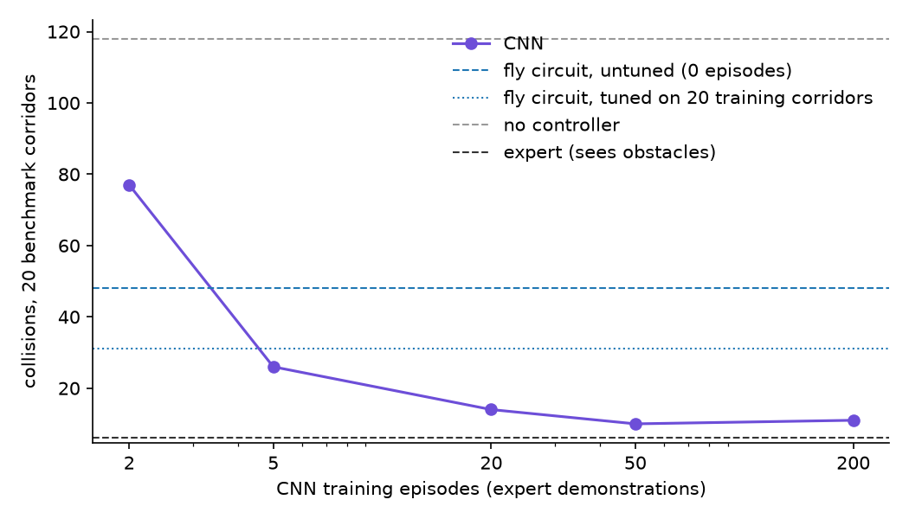

# A fly's escape reflex, flying a drone

Date: 2026-09-16
Description: A hardwired model of the fruit fly's looming-escape circuit against a small trained CNN, both steering a drone from the same 64x48 camera. The fly more than halves its collisions with no training, a CNN beats it after about five demonstration flights, and the reason it loses is that it flees from everything that looms.
Canonical: https://shauryasharma.tech/fly-circuit-vs-cnn.html

A fruit fly's fastest escapes run through a pair of large neurons called the
Giant Fibers. Almost all of the visual input reaching them comes from two
cell types, LPLC2 and LC4: between them, 99.4% of the Giant Fiber's direct
synapses from the optic lobe.

That's a very small circuit doing something that looks a lot like obstacle
avoidance. I wanted to know how far it gets if you wire it to a drone and
race it against a neural network that learned the same job from examples.

## The circuit, straight from the paper

Ache et al. (2019, *Current Biology*) fit a simple model to recordings from
the Giant Fiber while a fly watched a disc expand on a screen. It has two
terms. LPLC2 responds to how big the object looks, with a log-normal tuning
curve that peaks at 42 degrees. LC4 responds to how fast it's growing,
roughly linearly. The Giant Fiber's drive is a weighted sum of the two:

```
V_GF = 1.45 · V_LPLC2(size) + 1.62 · V_LC4(growth rate)
```

Those constants are published, and I never tuned them. The paper also has
two inhibitory terms, which I dropped for now. Everything on top of the sum
is mine: the threshold where drive becomes an escape, the dodge that
follows, and the steering. The paper's model was fit on trials where the
fiber didn't fire, so it says nothing about when an escape should happen.

The camera image gets averaged down to a 16 by 12 grid of
<span class="term" tabindex="0">ommatidia<span class="term-preview">The individual facets of an insect's compound eye. Here, one cell of a coarse grid over the camera image.</span></span>,
and the circuit measures motion on that grid. A drone flying forward sees
everything expand, obstacles or not, so a radial motion opponency step
(RMO) subtracts the expansion that forward flight alone would produce.
The largest connected patch of whatever survives is treated as the object.

## Two drones, one camera

Both drones fly the same procedurally generated corridor, 120 m long and
8 m wide, full of poles and boxes, at 4 m/s. Each sees only a 64 by 48
grayscale frame from a camera on its nose. Neither gets obstacle positions.

The second drone is flown by a CNN with about 35,000 parameters. It takes
the last four frames and outputs a steering value. It learned by copying a
scripted expert that *is* allowed to see obstacle positions and plans a
path around them. The CNN only ever sees the frames the expert flew
through.

I set one rule before any results existed: calibrate the fly once, and
never tune anything on the corridors used for the final evaluation. The
CNN gets a real training budget too, so the comparison isn't against a
network starved of data.

<figure>
  <div data-fly-vs-cnn data-weights="assets/flyvscnn-cnn.bin"></div>
  <figcaption>Both drones, live, on the same corridor. The small inset in each panel is the whole input its controller gets. Under the fly is its Giant Fiber drive against the escape threshold; under the CNN, its steering. Turn motion opponency off and the fly's drive pins itself above the line: that's the drone's own forward motion, read as a threat. On a narrow screen, the last button swaps between the two drones.</figcaption>
</figure>

## The renderer lied twice

All of this first ran on a cheap analytic renderer, and the fly's numbers
looked respectable. Moving to the real Three.js renderer turned up two bugs
in how frames came back from the GPU. They were too dark, because the
read-back was in linear color. They were also mirrored left to right. The
fly picks its dodge direction from which side of the view the threat is
on, so with mirrored frames it was carefully steering *into* obstacles.

The CNN would have learned from mirrored frames without complaint, since
its training data was mirrored the same way. The fly couldn't, because its
wiring assumes the left of the image is the left of the world. In this case
the hand-built model was the easier one to debug: it failed loudly.

## A hundred corridors nobody tuned on

With both bugs fixed and everything frozen, both drones flew 100 held-out
corridors once:

| controller | training episodes | collisions | average steering |
|---|---|---|---|
| no controller | - | 665 | 0.79 |
| fly circuit | 0 | 288 | 0.76 |
| fly circuit, tuned | 0 | 195 | 0.52 |
| CNN | 2 | 373 | 0.10 |
| CNN | 5 | 213 | 0.12 |
| CNN | 20 | 81 | 0.13 |
| CNN | 200 | 49 | 0.12 |
| expert (sees obstacles) | - | 25 | 0.14 |

With no training at all, the fly cuts collisions by more than half, so the
circuit does work. A CNN trained on five demonstration flights, about two
and a half minutes of flying, already beats it, and it keeps improving with
more data.

"Tuned" means a random search over the seven constants I made up (the
threshold, the dodge length and the rest) on 20 training corridors, with
the biology held fixed. My first attempt scored on collisions alone and
found a fly that was dodging 94% of the time, so the search now also pays
for steering effort. Tuning helps, and the gain holds on unseen corridors:
288 down to 195. That's worth about as much as five episodes are to the
CNN.

<figure>
  
  <figcaption>Collisions on 20 benchmark corridors against the number of demonstration flights the CNN learned from. The dashed and dotted blue lines are the fly, untuned and tuned. The CNN crosses the untuned fly between two and five episodes.</figcaption>
</figure>

## Why the fly loses

The steering column gives it away. The fly steers hard most of the time,
and the CNN barely steers at all. I assumed the fly was spotting obstacles
too late, so I logged what it reported at every step and checked it
against the real corridor geometry.

It wasn't late. It escaped from 94% of the obstacles it was actually
heading for, at a median of 5.5 m, with time to get clear. The trouble was
everything else it escaped from. Only 17% of its escapes were at something
it would have hit, and 7% happened with nothing in view at all. The other
76% were at obstacles in plain sight that it was going to miss anyway.

That is the circuit doing what it evolved to do. LPLC2 and LC4 detect
looming, and nothing in them checks whether the looming thing is on a
collision course. For a fly that's probably the right trade, since a
wasted jump is cheap and a missed predator isn't. A drone in a cluttered
corridor pays for every false alarm with a swerve.

The obvious patch is the old sailor's rule: something you're about to hit
holds its bearing as it grows, and something you'll pass slides sideways,
so ignore the sliders. It cut the escapes by about two thirds. It also
started missing 39% of the real threats, up from 6%, most likely because
once the drone swerves, everything in view slides. Collisions on the
benchmark corridors went from 48 to 111, and I took it back out.

## Honest complication

Some of this is weaker than the table makes it look. Each CNN point is a
single training run. The expert it copies cheats, so the CNN learns from
better information than the fly ever gets. The fly's size estimate runs at
about a third of the true angular size, because flat-shaded obstacles only
produce motion at their edges. Treating the bounding box of that outline as
a filled shape helped (52 collisions down to 48 on the benchmark), but it's
still a workaround. And I dropped the paper's two inhibitory terms, which
are my best guess for what would calm the circuit down.

## Close

The fly circuit is a real controller: one published equation and seven
constants I chose more than halve a drone's collisions with no data at
all. What surprised me was where it fails. It sees obstacles early and
reliably, but it can't tell something coming at it from something going
past, and a network trained on two and a half minutes of flying can.
