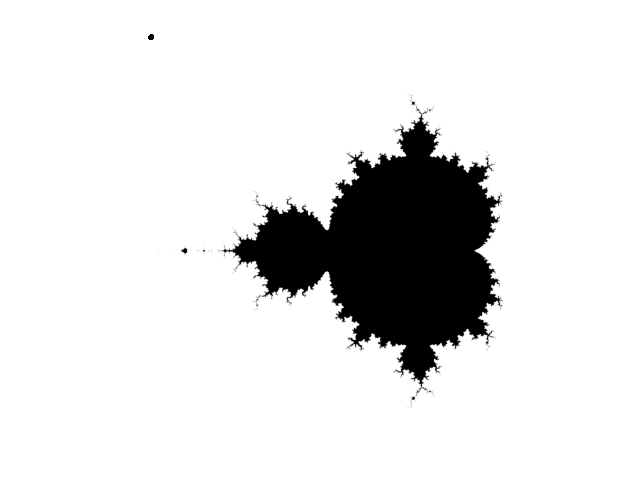
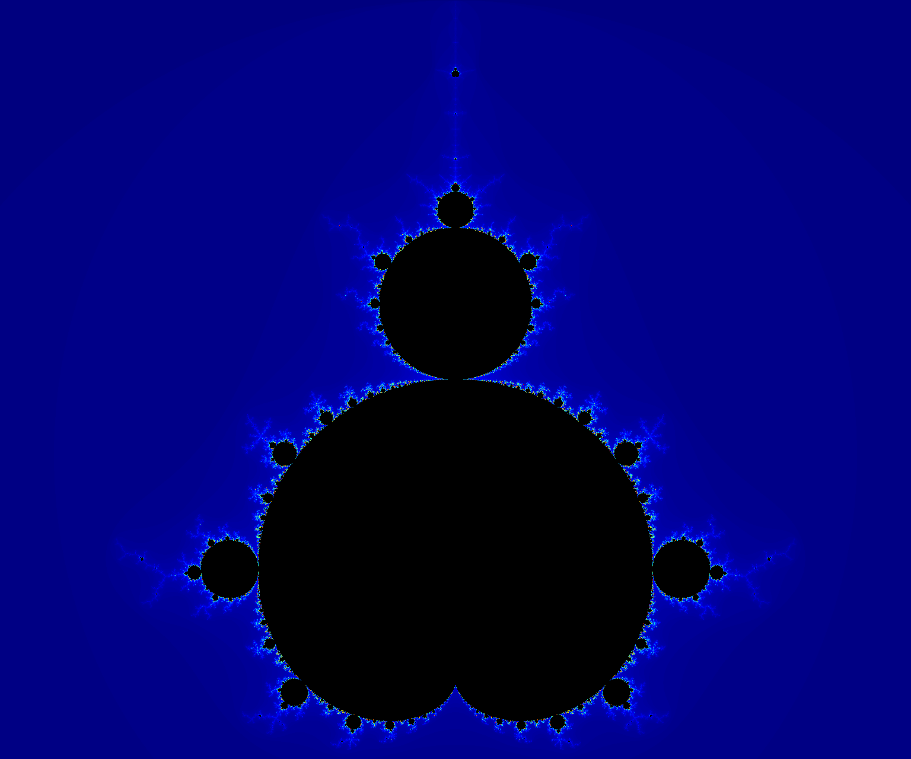
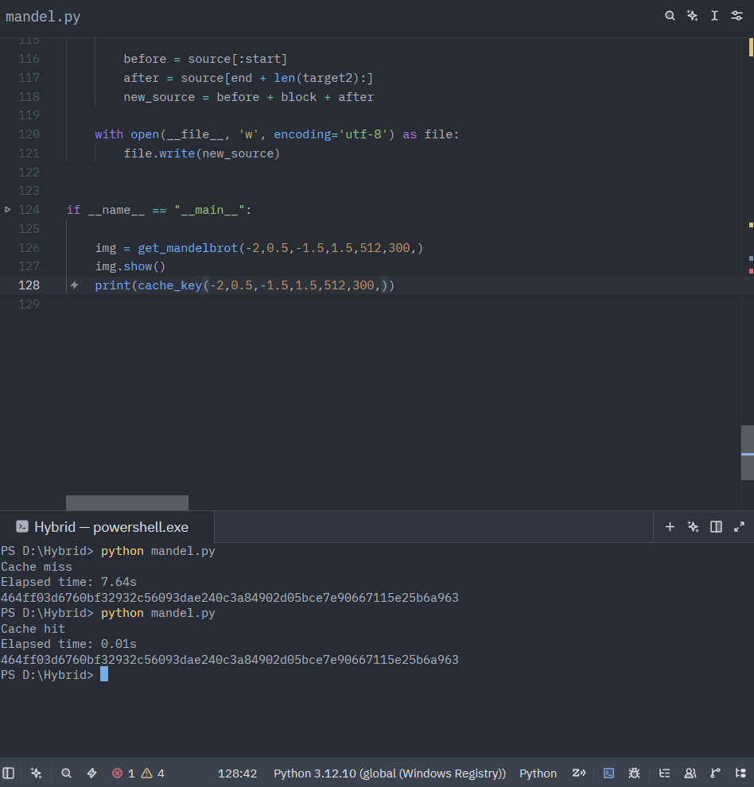
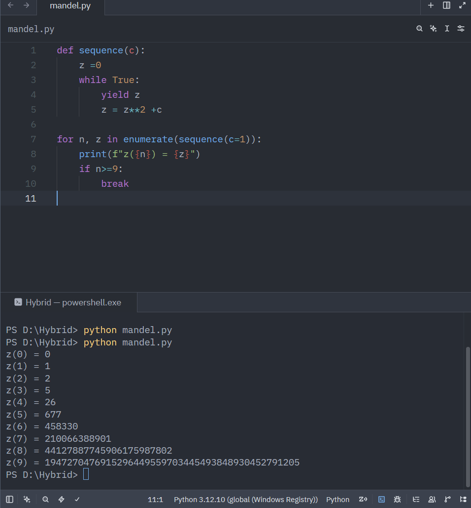

# A renderer that keeps notes on itself

Date: 2026-08-06
Description: A Mandelbrot renderer that doesn't cache to disk or a database - it rewrites its own source file to remember what it's already drawn.
Canonical: https://sslog.dpdns.org/self-rewriting-mandelbrot.html

A quine is a program that prints its own source code and nothing else. It's a
neat trick, but it's also a dead end - the output is always the same file you
started with. I wanted something that used the idea of a program editing
itself for an actual purpose: a program whose source code slowly accumulates
knowledge, instead of just reproducing itself.

The workload I picked was a Mandelbrot renderer. Rendering is deterministic -
the same viewport and parameters always produce the same image - and it's
expensive enough that caching is worth doing. Most renderers cache to a
folder of PNGs or a database. This one caches inside itself: every finished
render gets Base64-encoded and written directly into a dictionary sitting in
the `.py` file, and the file rewrites that one dictionary every time it
learns something new.

## Starting with membership, not escape time

The first version answered one question per pixel: is this point in the
Mandelbrot set or not. That's a boolean, so the image it produces is flat -
every pixel is either fully in or fully out, with no shading to suggest how
close a point came to escaping.

<figure>
  
  <figcaption>The first working version. In or out, nothing in between.</figcaption>
</figure>

That got replaced with an escape-time implementation almost immediately.
Instead of a boolean, each pixel records the iteration at which
`|z| > 2` first becomes true, and points that never escape get
capped at the maximum iteration count. That single change is what makes the
rest of the project possible - you can't build a colormap pipeline on top of
a boolean.

## The pipeline

Everything downstream of that decision is a fairly standard chain:

    viewport (center, zoom)
      → complex grid (NumPy)
      → escape-time matrix
      → normalize to [0, 1]
      → Matplotlib colormap
      → RGB array
      → PIL image

The viewport itself is described by a center point and a zoom factor rather
than raw bounds, which turned out to matter later - it's a much more natural
thing to hash and compare than four separate floats that all have to agree.

## Turning a render into something a dictionary can hold

A PIL image can't sit inside a Python literal, so every finished render goes
through one more conversion before it's eligible for caching:

    PIL Image → PNG bytes → Base64 → UTF-8 string

The lookup key for that string is a SHA-256 hash of everything that could
change the output - the viewport bounds, pixel density, iteration count, and
colormap, concatenated and hashed. Same parameters in, same key out, every
time:

    def cache_key(xmin, xmax, ymin, ymax, pixel_density, num_iterations, colormap):
        combined = f"{xmin}:{xmax}:{ymin}:{ymax}:{pixel_density}:{num_iterations}:{colormap}"
        return hashlib.sha256(combined.encode()).hexdigest()

## The one block the program is allowed to touch

The part I was most careful with was making sure the self-rewriting stayed
contained. The executable logic - the renderer, the hashing, the encode and
decode functions - never changes. Only one region does:

    # ===== AUTO-GENERATED START =====

    CONFIG = {}
    CACHE = {}
    STATS = {}

    # ===== AUTO-GENERATED END =====

On a cache miss, the file reads itself, finds those two marker comments,
rebuilds the block between them using `pprint.pformat()` so the
result is still valid Python, and writes the whole file back to disk. On the
next run, that block is just... there, as ordinary source, no different from
if you'd typed it in by hand. The program isn't reading a cache file at
startup - the cache *is* the startup state.

## Eleven ways to look at the same set

Once the colormap pipeline was in place, testing it meant rendering the same
view through every Matplotlib colormap worth trying. It's the same escape-time
matrix underneath each one - only the last step of the pipeline changes.

  

    <figure class="colormap-slide color" id="cm-inferno">
      
      <figcaption>inferno - the default.</figcaption>
    </figure>
    <figure class="colormap-slide color" id="cm-viridis">
      
      <figcaption>viridis.</figcaption>
    </figure>
    <figure class="colormap-slide color" id="cm-magma">
      
      <figcaption>magma.</figcaption>
    </figure>
    <figure class="colormap-slide color" id="cm-plasma">
      
      <figcaption>plasma.</figcaption>
    </figure>
    <figure class="colormap-slide color" id="cm-cividis">
      
      <figcaption>cividis.</figcaption>
    </figure>
    <figure class="colormap-slide color" id="cm-twilight">
      
      <figcaption>twilight.</figcaption>
    </figure>
    <figure class="colormap-slide color" id="cm-turbo">
      
      <figcaption>turbo.</figcaption>
    </figure>
    <figure class="colormap-slide color" id="cm-jet">
      
      <figcaption>jet.</figcaption>
    </figure>
    <figure class="colormap-slide color" id="cm-rainbow">
      
      <figcaption>rainbow.</figcaption>
    </figure>
    <figure class="colormap-slide color" id="cm-gist-rainbow">
      
      <figcaption>gist_rainbow.</figcaption>
    </figure>
    <figure class="colormap-slide color" id="cm-nipy-spectral">
      
      <figcaption>nipy_spectral - my favorite of the set, mostly because it looks the least like a default.</figcaption>
    </figure>
  

  

    <a href="#cm-inferno" aria-label="inferno">●</a>
    <a href="#cm-viridis" aria-label="viridis">●</a>
    <a href="#cm-magma" aria-label="magma">●</a>
    <a href="#cm-plasma" aria-label="plasma">●</a>
    <a href="#cm-cividis" aria-label="cividis">●</a>
    <a href="#cm-twilight" aria-label="twilight">●</a>
    <a href="#cm-turbo" aria-label="turbo">●</a>
    <a href="#cm-jet" aria-label="jet">●</a>
    <a href="#cm-rainbow" aria-label="rainbow">●</a>
    <a href="#cm-gist-rainbow" aria-label="gist_rainbow">●</a>
    <a href="#cm-nipy-spectral" aria-label="nipy_spectral">●</a>
  

Every one of those eleven renders lives in the cache under its own hash. The
first time each colormap is requested it costs a full render; every time
after that it's a Base64 decode, which is why the eleven images above were
each rendered exactly once, ever.

## What got left out

A few directions got explored and then deliberately dropped. Tile-based
caching - splitting the viewport into tiles so an infinite-zoom UI could
request only the tiles it needs - turned out to need a tile manager, an LRU
eviction policy, and a coordinate system for addressing tiles independent of
the top-level viewport. That's a reasonable project on its own; it just
isn't *this* project. A JavaScript/Web Worker port had the same
problem - interesting, but it dilutes the one thing that made the embedded
cache worth building in the first place. Scope stayed at four layers:
escape-time computation, rendering, embedded cache, source rewriting.
Everything else is future work, on purpose.

<figure>
  
  <figcaption>One of the throwaway sanity checks from before the pipeline was trustworthy - the same instinct as plotting a spiral before touching real math.</figcaption>
</figure>

## Does the cache actually help?

The only way to know is to measure it, so every call to
`get_mandelbrot()` is wrapped in `time.perf_counter()`. A
cache miss pays for the full NumPy escape-time computation; a cache hit pays
for a Base64 decode and a PNG parse. The gap between those two numbers is the
entire argument for embedding the cache in the first place - if reconstructing
from Base64 weren't meaningfully faster than recomputing, there'd be no
reason to bother rewriting the source file at all.

<figure class="color">
  
  <figcaption>Same viewport, same parameters, same key both times - 7.64s to render it, 0.01s to decode it back out of the source file.</figcaption>
</figure>

<figure class="color">
  
  <figcaption>Before any of it was a NumPy array, it was this - one point, one recurrence, watched by hand. c=1 escapes fast enough that by z(9) you're looking at a 43-digit number.</figcaption>
</figure>

## Coda

Nothing about the executable logic changes at runtime - the functions on
disk today are the same functions that were on disk before the first render
ever happened. What changes is a dictionary sitting between two comments,
getting a little larger every time the renderer sees a viewport, iteration
count, and colormap combination it hasn't seen before. It's not a quine. It
doesn't need to be. It just needs to remember.

The source is on GitHub:
[Shaurya-34/self_rewriting_mandelbrot][def].

[def]: https://github.com/Shaurya-34/self_rewriting_mandelbrot
